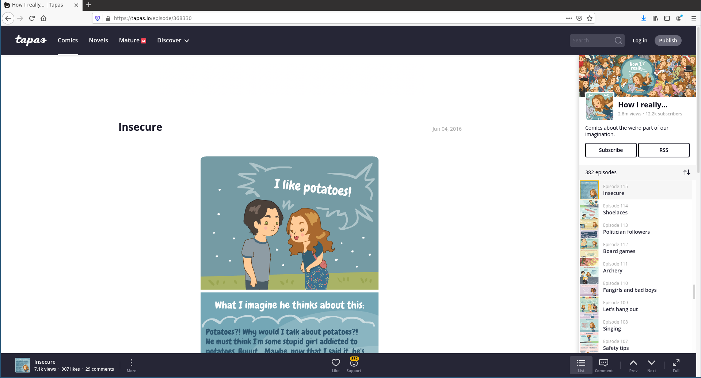

# tapas-rss

A Webextension (currently working on Firefox) that adds RSS buttons on [tapas.io](https://tapas.io) series pages.

Tapas is a platform for publishing and reading webcomics and webnovels and, while it still provides RSS feeds for the series it hosts, there is no ui component to access these feeds. This webextension restores such functionality.

Do you enjoy reading webcomics? Do you like using RSS instead of each different site's App/subscribe method? Then this extension is for you.

## Installation

- TODO

## tapas-rss in action 

Tapas-rss adds RSS buttons on:

 - A series' /info page
 

 - The sidebar in an episode page
 

 - The info modal in an episode page
 

## Permissions

No special permissions are needed.

## TODO: 

- [ ] Add github actions to test pushes to master
- [ ] Add extension to AMO
- [ ] Fix extension on chrome
- [ ] Add extension to chrome web store
