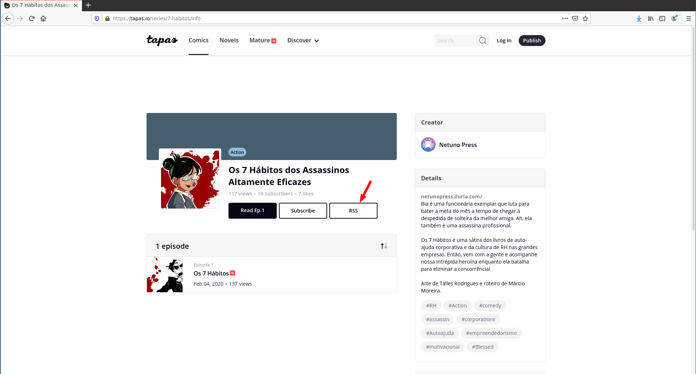
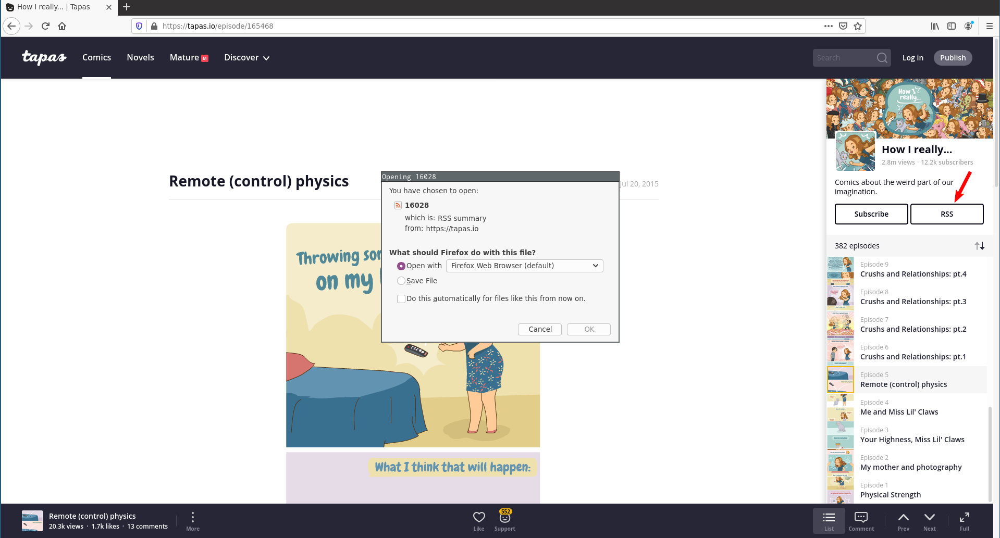
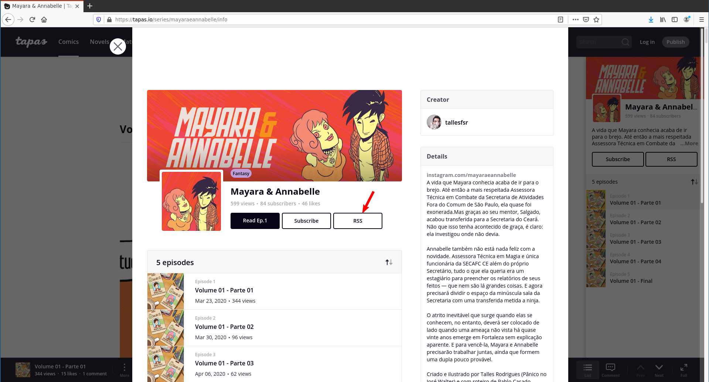

# tapas-rss 
 

A Webextension that adds RSS buttons on [tapas.io](https://tapas.io) series pages.

Tapas is a platform for publishing and reading webcomics and webnovels and, while it still provides RSS feeds for the series it hosts, there is no ui component to access these feeds. This webextension restores such functionality.

Do you enjoy reading webcomics? Do you like using RSS instead of each different site's App/subscribe method? Then this extension is for you.

## Installation

The Firefox Webextension can be installed directly from https://addons.mozilla.org - just click the button below to get to the installation page

The Chrome webextension can be installed from the [Chrome Web Store](https://chrome.google.com/webstore/detail/tapas-rss-button/oaodnnbbhbpcaoliplcpdhipcmgmpnnh)
## tapas-rss in action 

Tapas-rss adds RSS buttons on:

 - A series' /info page
 

 - The sidebar in an episode page
 

 - The info modal in an episode page
 

## Permissions

The only permission requested by the extension is access to data on tapas.io and m.tapas.io pages, as it is needed to inject the JS that creates the rss button and retrieves the series RSS feed.

## Similar projects: 

- A [userscript](https://greasyfork.org/en/scripts/405379-tapas-io-rss-button/code) was created by another tapas.io user which does the same as this extension. More information can be found in [this thread](https://forums.tapas.io/t/rss-feeds-gone/41724/5) at tapas.io forums.
